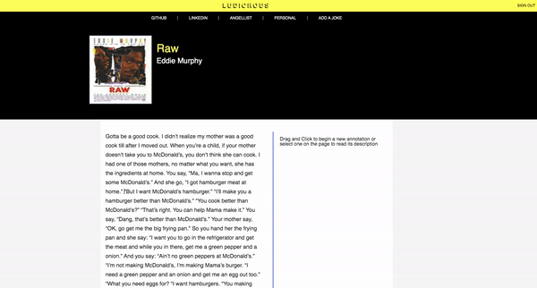
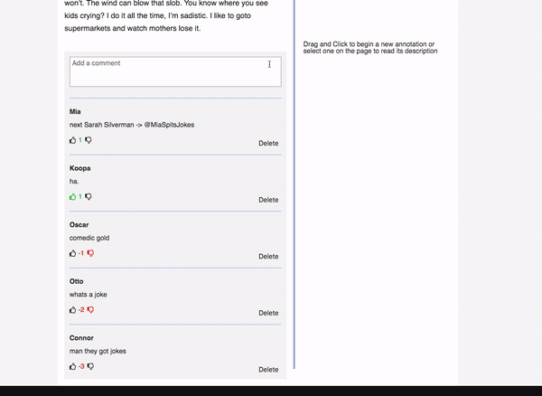
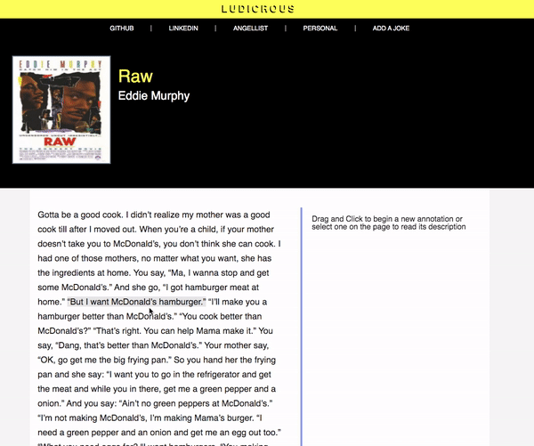
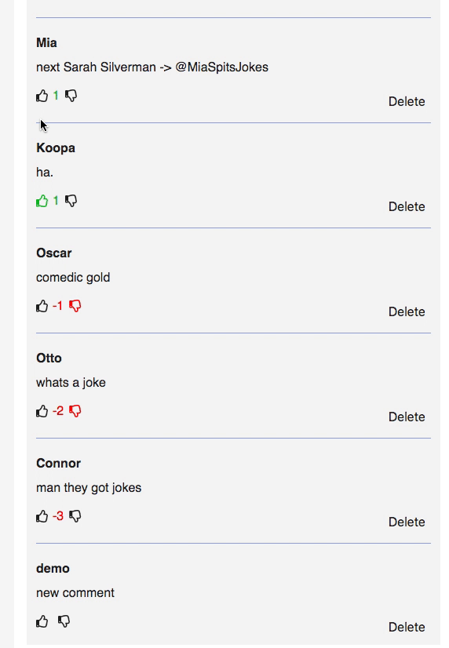

# Ludicrous

Ludicrous is a single page web application where users can share jokes with one another. Additionally, users can annotate, comment, and upvote on posts made by others. Based on the website Genius.

[Live Site](https://ludicrous.herokuapp.com/#/)

## Table of Contents
* [Technologies](#technologies)
* [Features](#features)
    * [Annotations](#annotations)
    * [Comments](#comments)
    * [Jokes](#jokes)
    * [Votes](#votes)
* [Installation](#installation)

## Technologies 

* Ruby on Rails (version 5.2.4)
* PostgreSQL (version 12.1)
* React (version 16.13.1)
* Redux (version 4.0.5)
* HTML 5
* CSS 3
* Heroku for hosting the app
* AWS S3 for storing images

## Features

Fundamental features to the app include: 
* [Annotations](#annotations)
* [Comments](#comments)
* [Jokes](#jokes)
* [Votes](#votes)

### Annotations
Annotations are the core of the app. Users that are signed in are able to click and drag
their mouse to select what part of the transcript they wish to annotation. Upon releasing the mouse,
a text area is rendered where the user can input what they desire about the selected text and then
click save to add it to the page. 



The following code calculates the start and end index of a new annotation.

```javascript
annotation(e) {
        e.preventDefault();
        const highlighted = window.getSelection();
        const startIndex = highlighted.anchorOffset;
        const endIndex = highlighted.focusOffset;
        const startOffset = parseInt(this.state.startElement.getAttribute('data-offset'))
        const endOffset = parseInt(e.target.getAttribute('data-offset'))
        const startPosition = startIndex + startOffset;
        const endPosition = endIndex + endOffset;
        if ( !this.props.currentUser || Boolean(startPosition) === false || Boolean(endPosition) === false || endPosition <= startPosition) {
            this.closeAnnotation()
        } else {  
            this.setState({
                startIndex: startPosition,
                endIndex: endPosition,
                annotation: true,
            }
        )}
    }
```
On the window, the getSelection() function creates an object of the range of text the user has highlighted. The functions anchorOffset and focusOffset called on this object return the start index and end index of the object, respectively, in the text paragraph. The start and end indices of the annotation were determined. In order to make an annotation, the current paragraph element storing the text of the transcript would be divided into three new elements: an paragraph element storing the text before the annotation, an anchor element containing the text chosen to annotate, and an additional paragraph element storing the text that succeeds the annotation. Both paragraph elements are created with offset attribute stored on the HTML element that stores the index at which the paragraph element would start in the original text had not been split into different HTML elements. The offset attribute accounts for the amount of characters in any paragraph or anchor elements that precede that current element where the annotation is being created. The method getAttribute is called on both the start and end elements of the annotation and then added to the variables containing the start and end indices of the annotation in its current element (determined by anchorOffet and focusOffset). Combined, this provides the of where the annotation occurs on the transcript text. This then allows for logic determining that the annotation is valid in that it has valid positions.

The code following shows the process of creating the annotation once its indices are accounted for properly:
```javascript
        const { joke, annotations, startAnnotation, annotation, displayAnnotation } = this.props;
        let annotatedJoke = [];
        let prevIndex = 0;
        let key = 0; 
        let sorted = Object.values(annotations).sort((a, b) => {
            if (a.start_index < b.start_index) {
                return -1
            } else {
                return 1
            }
        });
        sorted.forEach((annotation, idx) => {
            const jokeSlice = joke.slice(annotation.start_index, annotation.end_index);
            let before = joke.slice(prevIndex, annotation.start_index)

            annotatedJoke.push(
                <span key={key++} data-offset={prevIndex}>{before}</span>
            )
            annotatedJoke.push(
                <a key={key++}
                    onClick={() => displayAnnotation(annotation) }
                    className='annotated'>
                    {jokeSlice}
                </a>
            )
            prevIndex = annotation.end_index;
            if (idx === Object.keys(annotations).length - 1) {
                annotatedJoke.push(
                    <span
                        key={key++}
                        data-offset={prevIndex}>
                        {joke.slice(prevIndex, joke.length)}
                    </span>
                )
            }

        })
```
Props are passed into this function from the joke component where the indicies are calculated. 
Joke is the text of the transcript without any annotations. Annotations are all previously created
annotations. startAnnotation is a method that is invoked a callback on a mouseDown event to set the start element of the annotation to retrieve its offset attribute. Similarly, Annotation is a method that is utilized on a mouseUp event to invoke the
first set of code explained above. Both of these are set DisplayAnnotation is an other method set on previously created
annotations that through an onClick event allows users to render the description of the annotation along with comments made
on it. All three of methods are defined in the joke component which is rendering the annotations as it allows for a rerender of said component depending on the content of the props. In this code, annotations that previously existed are sorted based on their starting index in the joke transcipt. This sorting enables the comments to be looped through and determine their offset value that accounts for the annotations and text before it as well determine the actual text itself that comes before it. The sorting also allows the know what annotation comes last in the text and thus properly add all remaining text left in the transcript to come after it. 

### Comments
Comments allow users to leave input on either a post or an annotation. 



Comments were implemented via polymorphic associations. This allows the data of a comment whether its originating from a post or an annotation to be handled by one controller as well as all comments be stored in one table in the database. 

```ruby 
before_action :commenter, only: [:create]

def commenter 
        @klass = params[:comment][:commentableType].constantize
        @commenter = @klass.find(params[:comment][:commentableId])
end
```
The commentableType refers to the table of the data that the comment is being associated with (an annotation or post). By using the constantize method on it, the data is parse for a declared constant within that string, essentially the value of the string without the quotes. This value can then be used in association with ApplicationController's find method to locate the exact piece of data this comment needs to be associated with in the correct table. The before_action method at the top ensures that this method is ran before the create method that will save the comment in the database to allow us to only need one controller for comments, regardless of the data they are being associated with. 



### Jokes 
Jokes are the primary data of the app. Users can post joke transcripts as long as the title of the transcript, the author, and an image that correlates to it. 


When clicked, the Load More button sends a request to the backend to receive the next 7 jokes in the database based on time of creation of the joke.

### Votes 

Votes are utilized to allow users to give their input on annotation or comment not made by them. An upvote gives the associated data a value of one while a downvote gives it a value -1. By calculating the sum of the values of votes on a comment, comments can be rendered to used based on most upvoted. 



Votes were also implemented via polymorphic association.

## Installation
1. Run Bundle Install
2. Run NPM Install
3. Run bundle exec rails s to start backend server 
4. Run npm run webpack to compile and start frontend server


